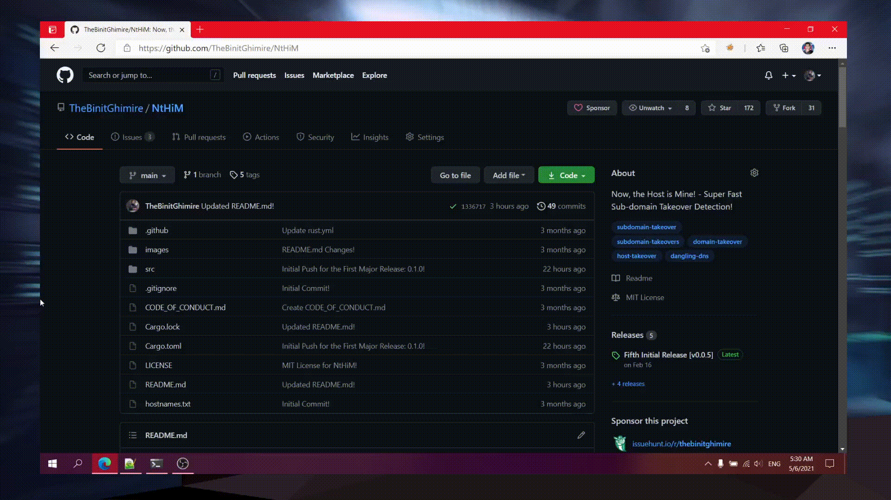

<!-- NtHiM | Now, the Host is Mine! - Super Fast Sub-domain Takeover Detection! -->

<p align="center">
        <a href="https://github.com/TheBinitGhimire/NtHiM/stargazers" target="_blank"></a>
        &nbsp;&nbsp;&nbsp;
        <a href="https://github.com/TheBinitGhimire/NtHiM/network/members" target="_blank"></a>
        &nbsp;&nbsp;&nbsp;
        <a href="https://github.com/TheBinitGhimire/NtHiM/issues" target="_blank"></a>
        <br />
        
        <br />
        &nbsp;&nbsp;&nbsp;
        <a href="https://github.com/TheBinitGhimire/NtHiM/releases" target="_blank"></a>
        &nbsp;&nbsp;&nbsp;
        <a href="https://crates.io/crates/NtHiM" target="_blank"></a>
</p>


***


<h3 align="center"> NtHiM - Super Fast Sub-domain Takeover Detection </h3>
<p align="center">
    <a href="https://github.com/TheBinitGhimire/NtHiM/releases/tag/0.1.3"></a>
    &nbsp;&nbsp;
    <a href="https://www.rust-lang.org/" target="_blank"></a>
</p>


***

## Installation

### Method 1: Using Pre-compiled Binaries
The pre-compiled binaries for different systems are available in the [**Releases**](https://github.com/TheBinitGhimire/NtHiM/releases) page. You can download the one suitable for your system, unzip the file and start using NtHiM.

### Method 2: Using Crates.io
**NtHiM** is available on **[Crates.io](https://crates.io/crates/NtHiM)**. So, if you have Rust installed on your system, you can simply install **NtHiM** with the following command:

```bash
cargo install NtHiM
```

### Method 3: Manual Build
You will need Cargo to perform the manual build for NtHiM.
If you have Cargo installed, you can simply follow the steps below:
1. Clone this repository, `git clone https://github.com/TheBinitGhimire/NtHiM`;
2. Go inside the folder, `cd NtHiM`;
3. Use the `cargo build` command,
4. Go inside the newly-created **target** folder, and open the **debug** folder inside it, `cd target/debug`;
5. You will find **NtHiM.exe** (on Microsoft Windows) or **NtHiM** binary (on most of the other platforms).

Before doing a manual build of NtHiM or installing through **Crates.io** with **`cargo`**, you might need to have OpenSSL installed in your system. Sometimes if you get an error during the manual building process, then the odds of the reason being due to OpenSSL are high. Please check out the [issue #1](https://github.com/TheBinitGhimire/NtHiM/issues/1) to figure out a solution for this issue.

The installation walkthrough for **NtHiM** has been uploaded to YouTube, covering all of these three methods, and you can watch the video here: **[How to Install and Use NtHiM (Now, the Host is Mine!)? Super Fast Sub-domain Takeover Detection!](https://youtu.be/CUTbqFhRjwY)**

***

## Usage

| Flag  | Description                         | Example                                  |
| ----- | ----------------------------------- | ---------------------------------------- |
|  -h   | Display help related to usage!      | NtHiM -h                                 |
|  -t   | Scan a single target!               | NtHiM -t https://example.example.com     |
|  -f   | Scan a list of targets from a file! | NtHiM -f hostnames.txt                   |
|  -c   | Number of Concurrent Threads!       | NtHiM -c 100 -f hostnames.txt            |
|  -v   | Enable Verbose Mode!				  | NtHiM -v -f hostnames.txt				 |
|  -o   | Write output to file!				  | NtHiM -f hostnames.txt -o output.txt	 |
|  -u   | Update signature cache!             | NtHiM -u                                 |
|  -V   | Display the version information!    | NtHiM -V                                 |

***

### Use Case 1 (Single Target):

```bash
NtHiM -t https://example.example.com
```

### Use Case 2 (Multiple Targets):

```bash
NtHiM -f hostnames.txt
```

***

### Usage Demonstration:



***

## Examples

### Single Target


### Multiple Targets using Concurrent Threads


***

## Workflow

### Platform Identification
**NtHiM** uses the data provided in **[EdOverflow/can-i-take-over-xyz](https://github.com/EdOverflow/can-i-take-over-xyz)** for the platform identification.

***

## Frequently Asked Questions (FAQs)
If you have any questions regarding **NtHiM**, please raise an issue by going to the **[Issues](https://github.com/TheBinitGhimire/NtHiM/issues)** page.

Some of your queries might have been answered in one of the existing issues, so please make sure to check the Issues with the **[FAQ](https://github.com/TheBinitGhimire/NtHiM/issues?q=is%3Aissue+label%3AFAQ)** label before raising an issue on your own.

***

## Contributions and Feature Requests
<p align="center">
    <a href="https://github.com/TheBinitGhimire/NtHiM/pulls"></a>
</p>


We welcome contributions from **NtHiM** users, developers and anyone who is interested to help in upgrading the status of the project. Therefore, we have prepared a [Contributing Guide](.github/CONTRIBUTING.md) that would be helpful for future contributors.

If you are interested in contributing in the development of **NtHiM**, you can feel free to create a **Pull Request** with modifications in the original code, or you shall open up a new **issue**, and we will try to include the feature as requested.

There is no restriction on anyone for contributing to the development of **NtHiM**. If you would like to contribute, you can feel free to do so, but please make sure to go through out [Contributing Guide](.github/CONTRIBUTING.md) before creating a Pull Request.

***

## Code of Conduct

Our Code of Conduct is available at [Contributor Covenant Code of Conduct](.github/CODE_OF_CONDUCT.md).